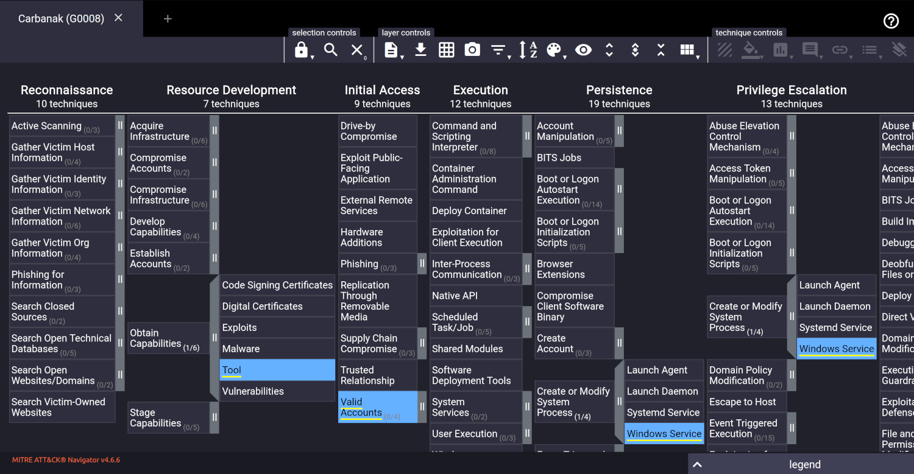

# MITRE ATT&CK

MITRE ATT&CK is a knowledge base of adversary tactics and techniques based on real-world observations. The ATT&CK 
knowledge base is used as a foundation for the development of specific threat models and methodologies in the 
private sector, in government, and in the cybersecurity product and service community.

|  |
|:--:|
| To use the ATT&CK Navigator: navigate to the groups summary page, next to "Techniques Used,"  navigate to "ATT&CK Navigator Layers," from the dropdown navigate to "view." An ATT&CK Navigator  layer should have opened with the selected group's TTPs highlighted in a new tab. |

## Resources

* [MITRE ATT&CK® Navigator](https://mitre-attack.github.io/attack-navigator/)