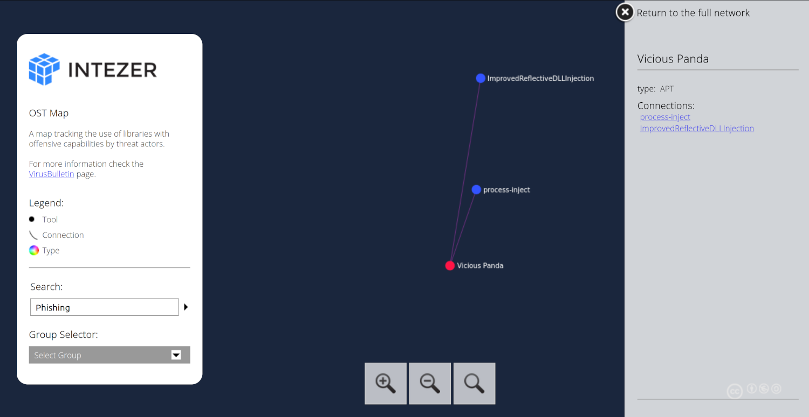

# OST Map

A map tracking the use of libraries with offensive capabilities by threat actors.

|  |
|:--:|
| OST Map provides a visual map to link multiple threat actors and their TTPs. |

## Resources

* [OST Map](https://www.intezer.com/ost-map/)