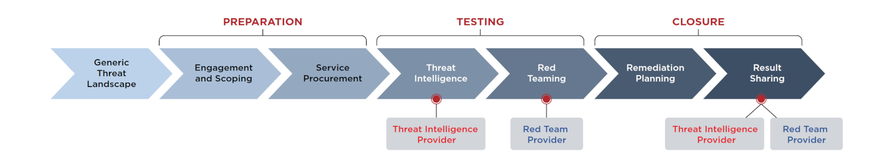

# TIBER-EU

TIBER-EU (Threat Intelligence-based Ethical Red Teaming) is a common framework developed by the European Central 
Bank that centers around the use of threat intelligence.

|  |
|:--:|
| How threat intelligence and red teaming fit into TIBER engagements |

In this framework, the "Testing" phase requires threat intelligence to feed the red team's testing. It encompasses 
a helicopter-view best practice rather than anything actionable from a red team perspective.

## Resources

* [TIBER-EU FRAMEWORK](https://www.ecb.europa.eu/pub/pdf/other/ecb.tiber_eu_framework.en.pdf) - whitepaper on 
"How to implement the European framework for Threat Intelligence-based Ethical Red Teaming".
* [FireEye solution brief](https://www.fireeye.com/content/dam/fireeye-www/services/pdfs/pf/ms/sb-tiber-eu.pdf) - 
Developing Cyber Resilience for Financial Institutions with TIBER-EU.